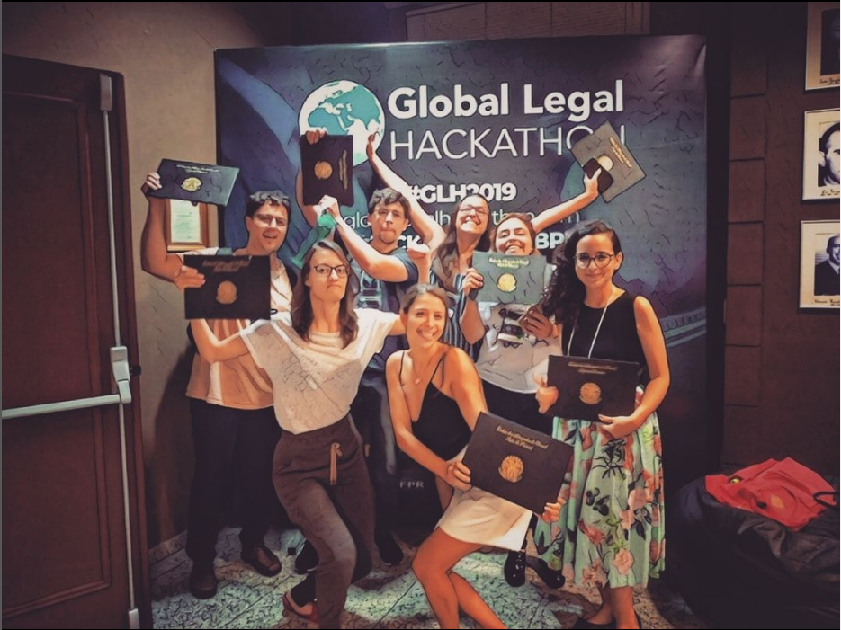
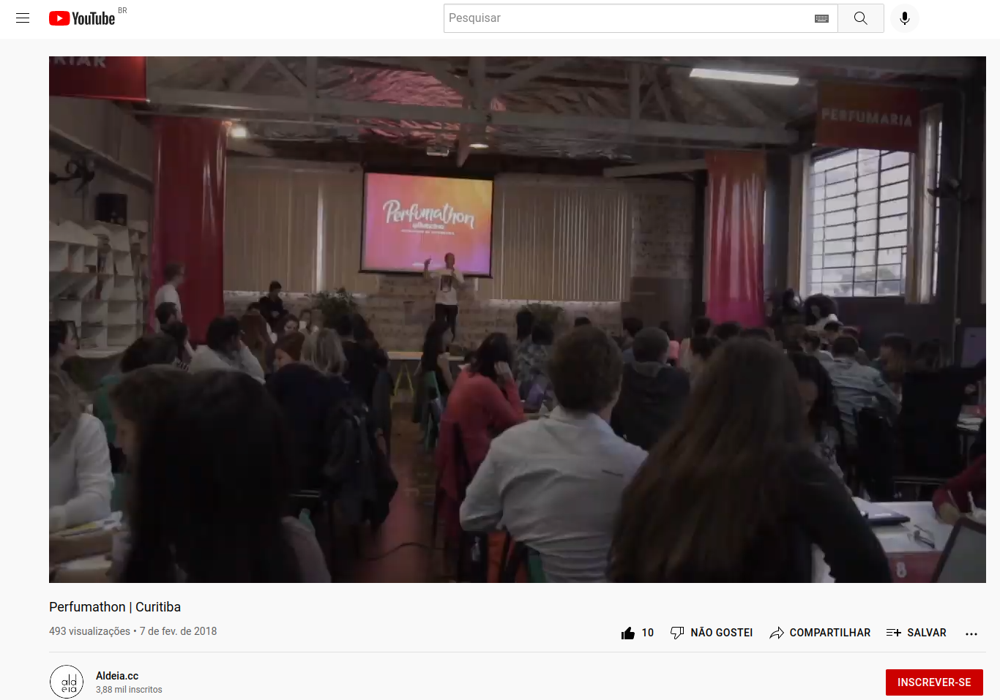
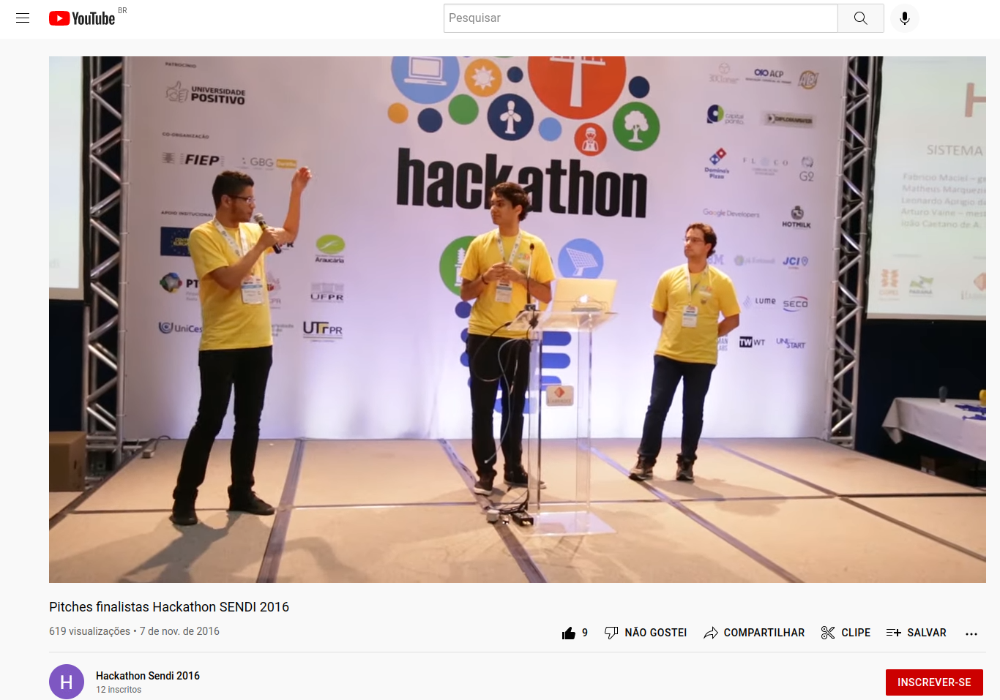

# Hackathons
## Winner and finalist in multiple contests.

## T
---
## T
---
## Acompanhamento 

   
2019 • 2nd place <a href='https://globallegalhackathon.com/'><b>Hackathon OAB-PR - GLH</b></a> (Vous Team), selective stage for world level 
2017  • 3rd place <a href='https://www.youtube.com/watch?v=YVSlHFDyucg'><b>Perfumathon - O Boticário</b></a> (Epic Team), first perfumery hackathon 
2016  • Finalist <a href='https://www.youtube.com/watch?v=KvzbUcHXvps&t=292s'><b>Hackathon SENDI-COPEL</b></a> (Hack'nergy Team), Intelligent Customer Relationship
   

## 2019 • OAB-PR - GLH (Vous Team)
 
  

## 2017 • O Boticário - Perfumathon (Epic Team)
 
  

## 2016 • SENDI-COPEL (Hack'nergy Team)
 
  

